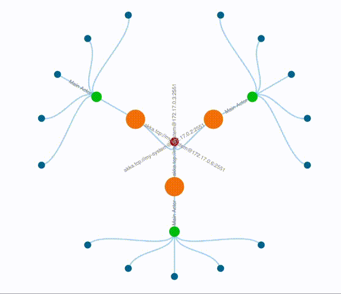

# Akka Cluster Visualizer



### Setup

Project is published here
[Nolan's Bintray](https://bintray.com/ngrace/akka-cluster-visualization)

To setup the akka cluster visualizer all you need to do is first create the Tree Actor.  The Tree actor will keep track 
of the structure of your actors and also expose the UI to your browser.

```
system.actorOf(TreeModelActor.props(frontEndPort, shardRegion), "tree-actor")
```

To start a node 

```
sbt "test:runMain sample.ClusterRunner 2551 8080"
```